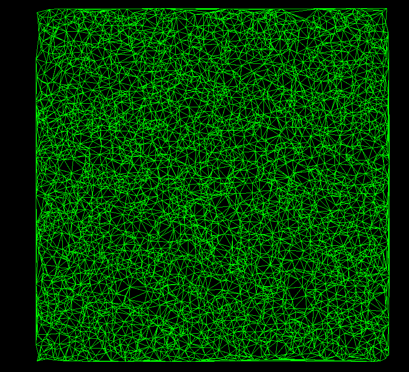
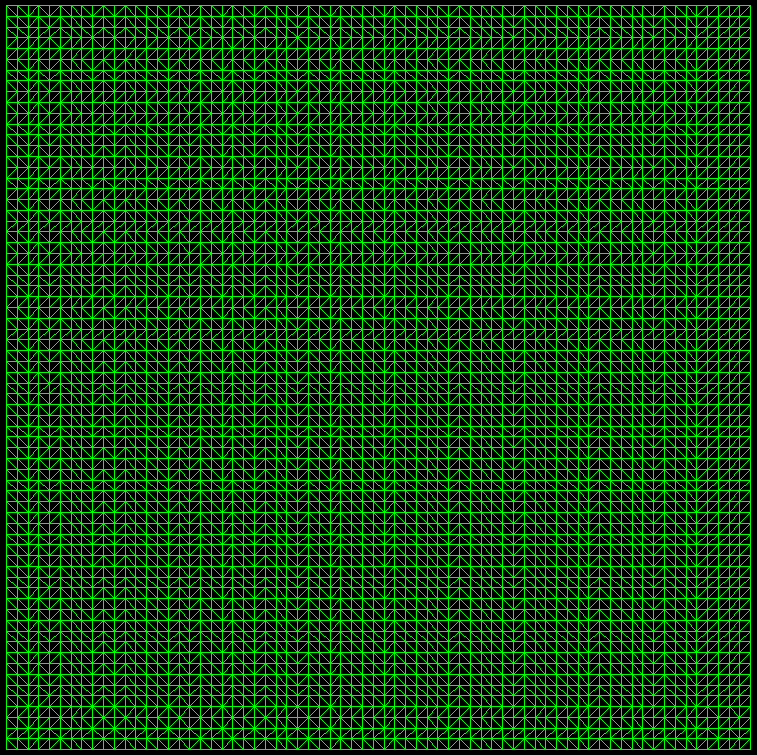

# Proyecto de Triangulación de Delaunay usando Half-Edge Data Structure

Este proyecto implementa la triangulación de Delaunay utilizando la estructura de datos Half-Edge. La triangulación de Delaunay es una partición de un conjunto de puntos en el plano en triángulos de manera que no existen puntos del conjunto dentro del circuncírculo de ningún triángulo. Es útil en aplicaciones geométricas como la generación de mallas, gráficos computacionales y simulaciones físicas.

## Estructura de Datos: Half-Edge

La estructura de datos Half-Edge es eficiente para representar superficies y realizar operaciones sobre ellas, como la triangulación. Consiste en:

- Vertices (Vértices): Los puntos del gráfico.

- Half-Edges (Medios Lados): Representan los bordes entre dos vértices. Cada borde se almacena como dos half-edges, uno en cada dirección.

- Facets (Caras): Cada triángulo está representado por tres half-edges que apuntan a sus vértices.

### Ventajas de Half-Edge

- Acceso eficiente: Facilita la navegación a través de la malla permitiendo moverse de un half-edge al siguiente, a su opuesto, o a los vértices asociados en tiempo constante.

- Eficiencia espacial: Almacena solo las conexiones necesarias, evitando la redundancia de información.
  Complejidad

- Inserción de vértices: O(n), donde n es el número de triángulos.

- Actualización de malla (Flip de bordes): O(1) por operación.
  Búsqueda de triángulo contenedor: O(log n) en promedio si la malla está balanceada.

## Triangulación de Delaunay

La triangulación de Delaunay maximiza los ángulos mínimos de los triángulos, evitando ángulos muy agudos. Además, satisface la condición de que ningún vértice se encuentre dentro del circuncírculo de un triángulo, lo que asegura que la triangulación es óptima para interpolación y suavizado de superficies.

### Método de Construcción

Se utiliza un enfoque incremental, en el que los puntos se añaden uno a uno a la malla de Delaunay existente. Para cada punto insertado, se localiza el triángulo que lo contiene y luego se ajusta la malla para satisfacer la condición de Delaunay realizando flips de bordes donde sea necesario.

### Ventajas de Delaunay

- Interpolación eficiente: Proporciona una buena distribución de triángulos.
  Robustez geométrica: Minimiza la posibilidad de tener triángulos degenerados o mal condicionados.

## Tecnologías Utilizadas

- Lenguaje: Python
  Bibliotecas:
- pygame: Para visualización de la malla generada.
- math, random, time: Funcionalidades matemáticas y gestión de aleatoriedad.
- mpmath: Para realizar cálculos precisos y robustos (opcional).

## Configuración del Entorno de Desarrollo

Prerrequisitos
Instala Python 3.10 o superior. Para instalar las dependencias del proyecto, sigue los siguientes pasos:

En la raíz del proyecto, instala los paquetes necesarios con:

```bash
pip install -r requirements.txt
```

El archivo requirements.txt contiene las dependencias necesarias para ejecutar el proyecto:

```bash
pygame==2.0.1
mpmath==1.2.1
```

## Ejecución del Proyecto

Ejecuta el archivo principal main.py para visualizar la malla generada. Utiliza los siguientes comandos para personalizar la ejecución:

```bash
python main.py --size SIZE --points POINTS --grid
```

- --size: Tamaño del área de visualización.
- --points: Número de puntos a insertar.
- --grid: Si está presente, se genera una malla rectangular en lugar de una malla aleatoria.

## Ejecución de Tests

Para ejecutar los tests unitarios, utiliza:

```bash
python test.py
```

Esto ejecutará una batería de pruebas sobre las distintas funcionalidades del proyecto, asegurando que todo funcione correctamente.

### Ejecución con Opciones

Sin argumentos adicionales:

```bash
python main.py
```

Utiliza los valores por defecto de tamaño y número de puntos.

Con tamaño y número de puntos personalizados:

```bash
python main.py --size 50000 --points 100
```

Con una malla rectangular (grid):

```bash
python main.py --size 50000 --points 100 --grid
```

## Instrucciones para la visualización en Pygame

El programa proporciona una interfaz gráfica para visualizar la malla de triangulación utilizando pygame. Aquí están los controles disponibles:

- Mover la vista: Mantén presionado el botón izquierdo del ratón y arrastra para mover la vista de la malla.

- Hacer zoom: Usa la rueda del ratón para acercar (scroll hacia arriba) o alejar (scroll hacia abajo) la vista.

- Cerrar la visualización: Pulsa el botón de cerrar ventana o presiona cualquier tecla para salir.

- Ver vertices: al presionar la tecla A se puede alternar entre ver los vértices o no.

- Ver half-edges eliminados: al presionar la tecla S se puede alternar entre ver los half-edges eliminados o no.

## Ejemplos

- Malla con grid de tamaño 5000 y de 5000 puntos agregados aleatoriamente:
  

- Malla con grid de tamaño 5000 y de 5000 puntos en un grid equiespaciado:
  

## Complejidades de la Implementación

- Actualización de vértices, half-edges y caras: Al insertar un nuevo punto en la malla, es necesario actualizar correctamente los vértices, las aristas y las caras para garantizar que la malla mantenga su estructura topológica. Esta operación fue compleja de implementar, ya que requiere subdividir los triángulos existentes y garantizar que los half-edges mantengan sus relaciones correctamente.

- Comprobación de la condición de Delaunay: Para garantizar que la triangulación mantenga la condición de Delaunay, se debe verificar que el vértice opuesto a cada arista no esté dentro del circuncírculo del triángulo correspondiente. Esto implica realizar una serie de operaciones geométricas que, aunque eficientes, añaden complejidad al código.

## Author

Sebastián Mira Pacheco
